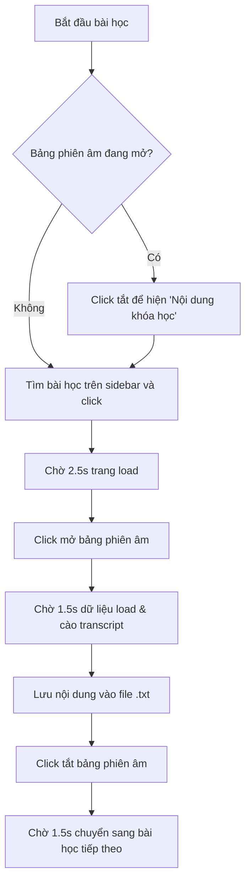

# Udemy Transcript Scraper

Công cụ tự động hóa sử dụng Python Playwright kết nối qua Chrome DevTools Protocol (CDP) để cào phiên âm (transcripts) các bài học trên Udemy từ một trình duyệt đang chạy sẵn.

## Cấu trúc thư mục

*   [create_files.py](file:///G:/Agent2026Win/agents/1_foundations/code_udemy/create_files.py): Script khởi tạo các file văn bản rỗng `.txt` tương ứng với tiêu đề các bài học. Tự động chuyển đổi các ký tự không hợp lệ trên Windows (ví dụ `:` thành ` -`).
*   [run_automation.py](file:///G:/Agent2026Win/agents/1_foundations/code_udemy/run_automation.py): Script tự động hóa chính. Kết nối tới Thorium, duyệt qua từng bài học, mở panel phiên âm, cào văn bản và lưu vào file tương ứng.
*   [README.md](file:///G:/Agent2026Win/agents/1_foundations/code_udemy/README.md): Hướng dẫn sử dụng và tùy biến này.

---

## Nguyên lý hoạt động (Symmetric Toggle Method)

Để đảm bảo script chạy ổn định mà không bị mất dấu phần tử trong DOM (giao diện Udemy ẩn danh sách bài học khi panel phiên âm hiển thị), script sử dụng thuật toán **Bật/Tắt đối xứng**:



---

## Hướng dẫn tùy biến cho chương mới (Chapters khác)

Khi muốn áp dụng công cụ này cho các chương học khác (ví dụ: Chương 2 `2_openai`), hãy thực hiện theo các bước sau:

### Bước 1: Khởi tạo các file rỗng cho chương mới
1. Mở file [create_files.py](file:///G:/Agent2026Win/agents/1_foundations/code_udemy/create_files.py).
2. Thay đổi đường dẫn thư mục đích `target_dir`:
    ```python
    target_dir = r"G:\Agent2026Win\agents\2_openai\tai lieu"
    ```
3. Cập nhật danh sách tiêu đề bài học trong biến `titles` tương ứng với chương mới.
4. Chạy script để tạo hàng loạt file `.txt` rỗng:
    ```bash
    uv run 1_foundations/code_udemy/create_files.py
    ```

### Bước 2: Cấu hình Script tự động hóa
1. Mở file [run_automation.py](file:///G:/Agent2026Win/agents/1_foundations/code_udemy/run_automation.py).
2. Cập nhật thư mục tài liệu đích `TAI_LIEU_DIR`:
    ```python
    TAI_LIEU_DIR = r"G:\Agent2026Win\agents\2_openai\tai lieu"
    ```
3. Cập nhật dải bài học cần quét trong hàm `main()` (ví dụ từ bài 29 đến bài 45):
    ```python
    # Thay đổi dải số bài học tương ứng (ví dụ: range(29, 46))
    lessons_to_process = [l for l in range(start_num, end_num + 1) if l in file_map]
    ```

### Bước 3: Chuẩn bị Trình duyệt
1. Khởi chạy Thorium ở chế độ debug port `9222` với profile tương ứng:
    ```powershell
    & "C:\Users\hieu\AppData\Local\Thorium\Application\thorium.exe" --remote-debugging-port=9222 --profile-directory="Profile 1"
    ```
2. Đăng nhập Udemy, mở khóa học và **click mở rộng (expand) tất cả các section của chương mới trên sidebar** để hiển thị danh sách bài học.
3. Chuyển trình duyệt về bài học bắt đầu của chương đó.

### Bước 4: Chạy cào dữ liệu tự động
Chạy lệnh sau trên terminal của workspace để khởi động quá trình cào tự động:
```bash
uv run 1_foundations/code_udemy/run_automation.py
```
*Lưu ý: Không tương tác chuột/bàn phím vào cửa sổ Thorium trong quá trình script đang chạy.*
